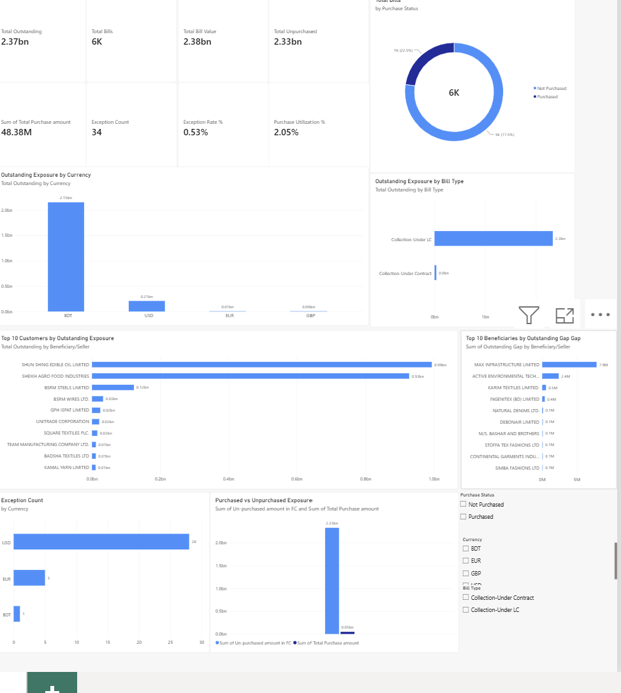

# LC Portfolio Analytics

## Project Overview

This project analyzes an export bill portfolio using Python, Pandas, and Power BI.

The objective is to evaluate portfolio exposure, purchase utilization, customer concentration, reconciliation exceptions, and operational risk indicators across export bill transactions.

The project uses an anonymized dataset to protect customer and transaction confidentiality.

## Tools Used

- Python
- Pandas
- Power BI
- Excel

## Dataset

The dataset contains export bill transaction records with fields related to:

- Bill value
- Outstanding exposure
- Purchase amount
- Unpurchased amount
- Currency
- Bill type
- Beneficiary / seller
- Applicant / buyer
- Tenor
- Maturity date
- Purchase status
- Reconciliation results

## Key Analysis Areas

- Portfolio exposure analysis
- Purchased vs unpurchased exposure
- Customer concentration
- Currency exposure
- Bill type distribution
- LC / contract analysis
- Reconciliation exception analysis
- Outstanding gap analysis
- Purchase utilization analysis

## Key Findings

- The portfolio is heavily concentrated in LC-based transactions.
- A large proportion of the portfolio remains unpurchased.
- Reconciliation exceptions represent a small proportion of total records.
- Outstanding gaps are concentrated among a limited number of transactions and counterparties.
- Customer and beneficiary concentration analysis highlights areas requiring closer monitoring.

## Power BI Dashboard

The Power BI dashboard provides an interactive view of:

- Total portfolio exposure
- Outstanding exposure
- Purchased and unpurchased exposure
- Currency concentration
- Bill type distribution
- Top customers by outstanding exposure
- Top beneficiaries by outstanding gap
- Reconciliation exceptions



## Project Structure

```text
LC_Portfolio_Analytics/
├── data/
│   └── Export_Bill_Portfolio_Anonymized.xlsx
├── scripts/
│   └── LC_Portfolio_Analytics.py
├── powerbi/
│   └── LC_Portfolio_Analytics.pbix
├── images/
│   └── dashboard_overview.png
└── README.md

## Confidentiality

The dataset used in this public project has been anonymized. Customer names, transaction identifiers, bank references, and other sensitive information have been masked while preserving the analytical structure of the portfolio.

## Author

Jamilur Rashid Sunny